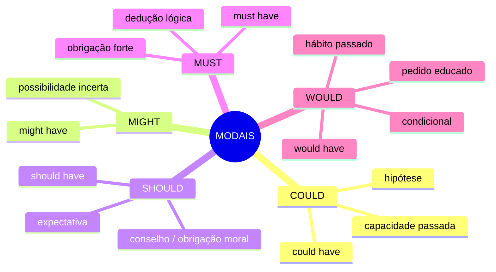

# Modais — Visão Geral

```mermaid
mindmap
  root((MODAIS))
    COULD
      capacidade passada
      hipótese
      could have
    MIGHT
      possibilidade incerta
      might have
    SHOULD
      conselho / obrigação moral
      expectativa
      should have
    MUST
      obrigação forte
      dedução lógica
      must have
    WOULD
      condicional
      hábito passado
      pedido educado
      would have
```
