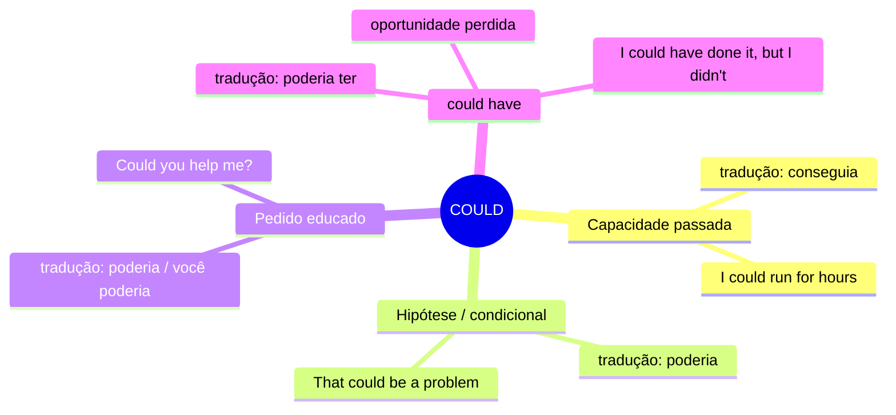

# COULD — Mapa Mental

## Resumo
| Uso | Tradução | Exemplo |
|---|---|---|
| Capacidade passada | conseguia | *I could swim at age 5* |
| Hipótese | poderia | *That could work* |
| Pedido educado | poderia | *Could you repeat that?* |
| could have | poderia ter | *I could have stayed* |

## Não confunda
- **could** (hipótese) vs **might** (possibilidade incerta)
  > *It could rain.* → é uma possibilidade real
  > *It might rain.* → não sei, talvez sim talvez não
