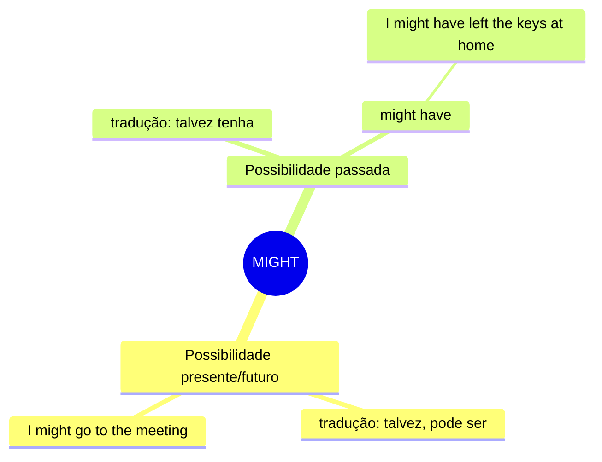

# MIGHT — Mapa Mental

## Resumo
| Uso | Tradução | Exemplo |
|---|---|---|
| Possibilidade presente/futuro | talvez, pode ser que | *I might call later* |
| might have | talvez tenha | *She might have forgotten* |

## Não confunda
- **might** vs **could** → might é mais incerto
  > *I might go.* → talvez sim, talvez não (50/50 ou menos)
  > *I could go.* → tenho como ir (foco na capacidade)

- **might have** vs **must have** → grau de certeza
  > *He might have left.* → talvez tenha saído (incerteza)
  > *He must have left.* → deve ter saído (quase certeza)
