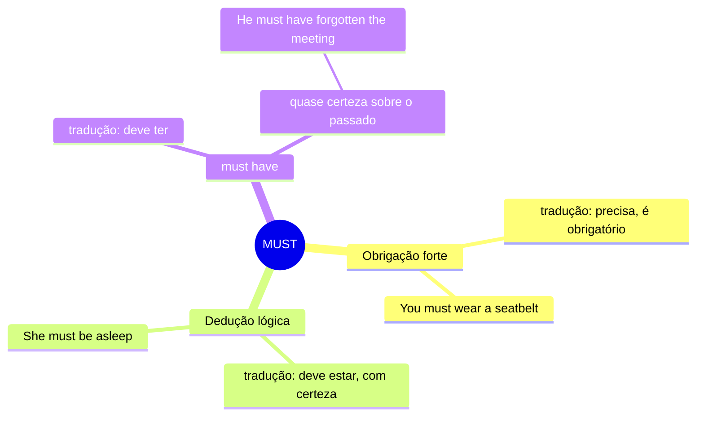

# MUST — Mapa Mental

## Resumo
| Uso | Tradução | Exemplo |
|---|---|---|
| Obrigação forte | precisa, é obrigatório | *You must sign this* |
| Dedução lógica | deve estar, com certeza | *You must be tired* |
| must have | deve ter | *They must have arrived already* |

## Não confunda
- **must** vs **should** → força da obrigação
  > *You should apologize.* → seria o certo
  > *You must apologize.* → não tem escolha

- **must have** vs **might have** → grau de certeza
  > *She must have seen it.* → tenho quase certeza
  > *She might have seen it.* → talvez tenha visto (incerto)
