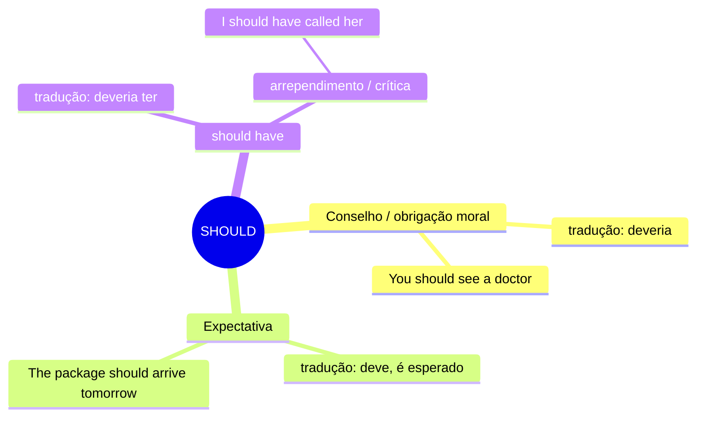

# SHOULD — Mapa Mental

## Resumo
| Uso | Tradução | Exemplo |
|---|---|---|
| Conselho | deveria | *You should rest* |
| Expectativa | deve, é esperado | *It should be ready by noon* |
| should have | deveria ter | *I should have studied more* |

## Não confunda
- **should** vs **must** → intensidade da obrigação
  > *You should wear a helmet.* → é recomendado
  > *You must wear a helmet.* → é obrigatório

- **should have** vs **could have** → sentimento diferente
  > *I should have called.* → era o certo, me arrependo
  > *I could have called.* → eu tinha como, mas não chamei
