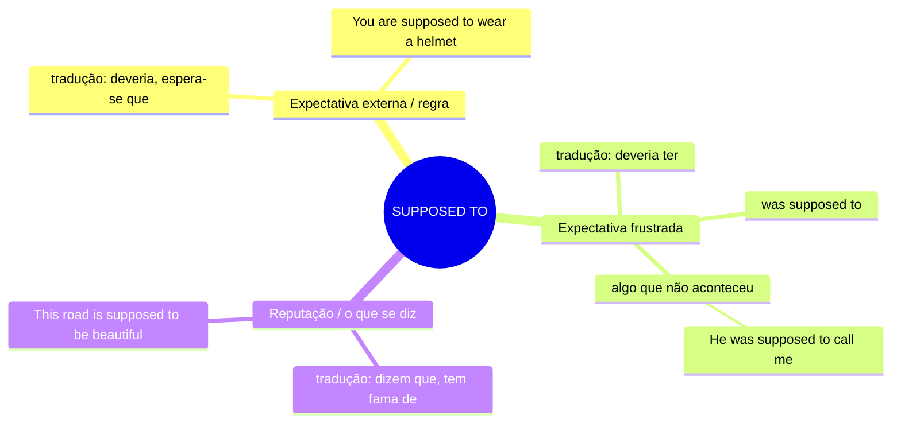

# SUPPOSED TO — Mapa Mental

## Resumo
| Uso | Tradução | Exemplo |
|---|---|---|
| Expectativa / regra | deveria, espera-se que | *You are supposed to wear a helmet* |
| Expectativa frustrada (passado) | deveria ter | *He was supposed to call me* |
| Reputação | dizem que, tem fama de | *It's supposed to be great* |

## Não confunda
- **supposed to** vs **should** → origem da obrigação
  > *You should call him.* → julgamento pessoal, conselho
  > *You are supposed to call him.* → expectativa externa — regra, acordo

- **was supposed to** → implica que **não aconteceu**
  > *I was supposed to be there.* → não estava lá
