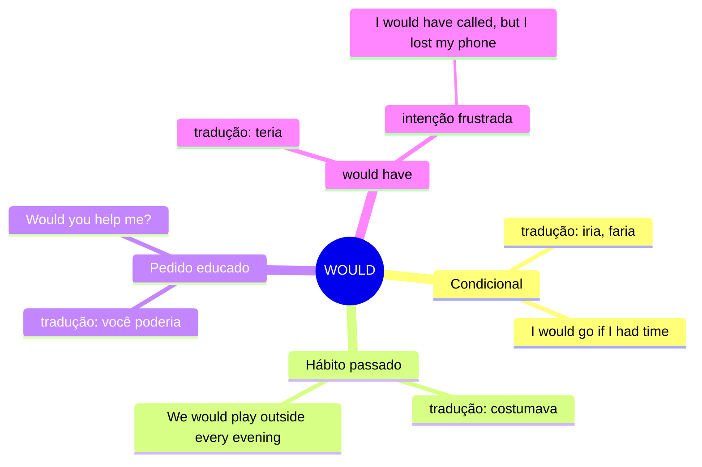

# WOULD — Mapa Mental

## Resumo
| Uso | Tradução | Exemplo |
|---|---|---|
| Condicional | iria, faria | *I would help if I could* |
| Hábito passado | costumava | *She would sing every morning* |
| Pedido educado | você poderia | *Would you mind waiting?* |
| would have | teria | *I would have stayed* |

## Não confunda
- **would** vs **used to** → hábito passado
  > *I would run every morning.* ✅ → ação repetida
  > *I used to run every morning.* ✅ → ação repetida
  > *I used to live in Porto Alegre.* ✅ → estado
  > *I would live in Porto Alegre.* ❌ → would não funciona para estados

- **would have** vs **could have**
  > *I would have gone.* → era minha intenção, mas algo impediu
  > *I could have gone.* → eu tinha como, mas não fui
