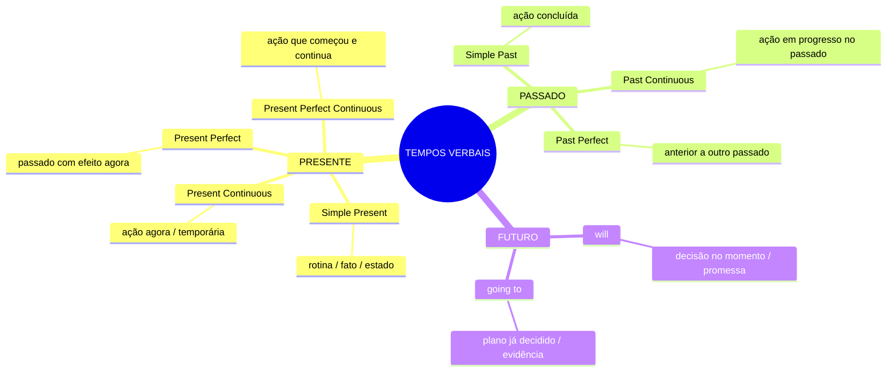

# Tempos Verbais — Visão Geral

## Armadilhas principais para brasileiros

| Confusão | Regra |
|---|---|
| Simple Present vs Present Continuous | rotina → *work* / agora → *am working* |
| Simple Past vs Present Perfect | tempo definido → past / efeito presente → perfect |
| Past Simple vs Past Continuous | concluído → *worked* / em progresso → *was working* |
| will vs going to | decisão agora → *will* / plano anterior → *going to* |
